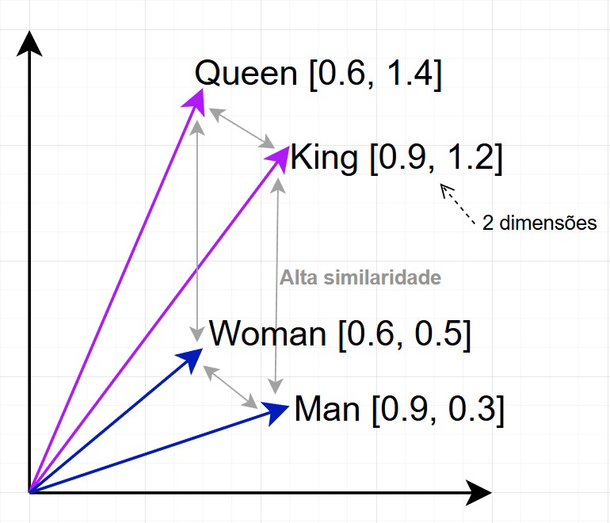
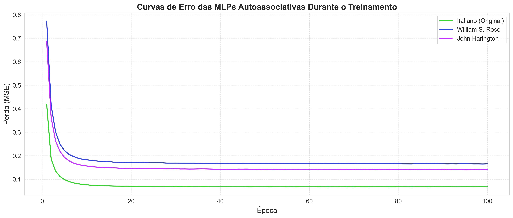
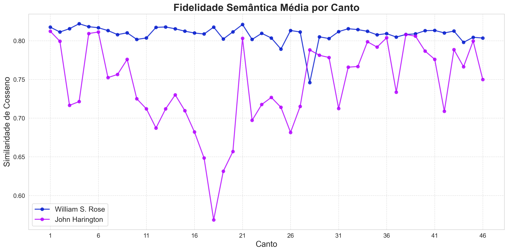
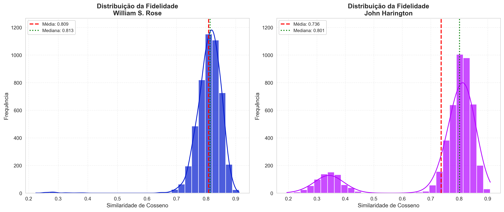

# 📖 Análise de Fidelidade Semântica - Orlando Furioso

[](https://www.python.org/)
[](https://pytorch.org/)
[](LICENSE)


Este projeto foi desenvolvido com o objetivo de **quantificar e visualizar a fidelidade semântica** de múltiplas traduções em inglês (William Stewart Rose (1823) e John Harington (1591)) em relação ao texto italiano do poema épico "Orlando Furioso" (1516) de Ludovico Ariosto. A metodologia integra Processamento de Linguagem Natural (PLN) com redes neurais MLP autoassociativas (autoencoders) para extrair e comparar representações semânticas refinadas.

<p align="center">
  
  <br>Ilustração de Gustave Doré.
</p>


## 🧠 A Rede Neural MLP Autoassociativa

A rede neural utilizada é uma **MLP Autoassociativa** (também conhecida como **Autoencoder**), composta por três camadas principais:

```
Arquitetura: [384 → 96 → 384]
- Camada de Entrada: Embeddings de 384 dimensões
- Camada Oculta (Latent Space): 96 dimensões (compressão 4:1)
- Camada de Saída: Reconstrução de 384 dimensões
```

### **Motivação para a Escolha:**

1. **Aprendizado de Representações Semânticas Refinadas**  
   Os embeddings multilíngues fornecem uma boa representação semântica inicial, mas são modelos genéricos treinados em textos diversos. A MLP autoassociativa vai além: ela aprende os padrões específicos da obra. Esse refinamento cria vetores mais "especializados" que facilitam a comparação precisa entre original e traduções, destacando diferenças sutis de significado que os embeddings genéricos poderiam não capturar com a mesma profundidade.

2. **Redução de Dimensionalidade e Extração de Características**  
   A obra "Orlando Furioso" é extensa (~4.800 estrofes), resultando em vetores de alta dimensão. A MLP atua como **redutor de dimensionalidade**, comprimindo a informação (neste caso em 4:1) através de uma camada oculta menor. Esse processo força o modelo a aprender as **características mais essenciais** dos dados, criando um **espaço latente** que foca nas informações mais relevantes e mitiga grande parte dos ruídos.

3. **Flexibilidade Arquitetural**  
   A arquitetura da MLP pode ser ajustada (número de camadas, neurônios) para otimizar a codificação de informações específicas do domínio literário.

### **Como o Pipeline Funciona:**

O fluxo de dados segue estas etapas:

1. **Ingestão e Pré-processamento**: Textos são segmentados em **estrofes** (mantendo registro de canto e posição), convertidos para minúsculas e normalizados.

2. **Vetorização Semântica**: Estrofes são convertidas em **embeddings multilíngues** de 384 dimensões que capturam o significado semântico e são compatíveis entre idiomas.

3. **Refinamento Neural**: Cada conjunto de embeddings (original italiano e traduções inglesas) é alimentado em uma **MLP autoassociativa separada**, que aprende a comprimir cada embedding em 96 dimensões até que a descompressão seja satisfatória, resultando em embeddings latentes que preservam as informações essenciais.

4. **Cálculo de Fidelidade**: Para cada estrofe, comparamos as **representações latentes** (96 dims) do italiano original com as das traduções inglesas usando a **similaridade de cosseno**. Essa métrica funciona porque os embeddings multilíngues mapeiam textos de diferentes idiomas para o mesmo **espaço vetorial**, onde palavras/frases com significados similares ficam próximas independentemente do idioma; As MLPs preservam essa propriedade ao comprimir os dados, mantendo as relações semânticas. Assim, quanto mais próximas as representações latentes estiverem no espaço vetorial, mais fiel semanticamente é a tradução.

5. **Visualização e Análise**: Os scores de fidelidade são representados em gráficos para comparação entre traduções, identificação de padrões e análise estatística.

<p align="center">
  
  <br>Não é possível visualizar um espaço de 96 dimensões.
</p>


## 📝 Metodologia Detalhada

### **1. Parsing dos Textos**
- Segmentação precisa por **canto** e **estrofe** usando regex
- Alinhamento estrutural entre as 3 versões
- Tratamento de estrofes ausentes/desalinhadas com valores `NaN`

### **2. Geração de Embeddings**
- Modelo: `paraphrase-multilingual-MiniLM-L12-v2` (384 dims)
- Pré-processamento: lowercase + normalização Unicode (NFC) para caracteres especiais italianos
- Padronização: `StandardScaler` aplicado conjuntamente em todas as obras

### **3. Treinamento das MLPs Autoassociativas**
- **Loss**: MSE (Mean Squared Error)
- **Optimizer**: Adam (learning rate = 0.001)
- **Epochs**: 100
- **Device**: CUDA (GPU) quando disponível, senão CPU

### **4. Cálculo de Fidelidade**
- **Métrica**: Similaridade de Cosseno entre representações latentes (96 dims)
- **Interpretação**: 
  - `≥ 0.90` → Fidelidade excelente
  - `0.70 - 0.89` → Fidelidade boa
  - `< 0.70` → Adaptação livre ou estrofe ausente


## 🚀 Como Executar

### 1️⃣ **Pré-requisitos**

- **Python 3.11+**
- **Poetry** ou **pip**

### 2️⃣ **Instalação**

#### **Opção A - Com Poetry (Recomendado):**

```powershell
# Instalar Poetry (se ainda não tiver)
(Invoke-WebRequest -Uri https://install.python-poetry.org -UseBasicParsing).Content | python -

# Clonar o repositório
git clone https://github.com/seu-usuario/fidelidade-semantica-orlando-furioso.git
cd fidelidade-semantica-orlando-furioso

# Instalar dependências
poetry install --no-root

# Ativar ambiente virtual
poetry shell
```

#### **Opção B - Com pip + requirements.txt:**

```powershell
# Clonar o repositório
git clone https://github.com/seu-usuario/fidelidade-semantica-orlando-furioso.git
cd fidelidade-semantica-orlando-furioso

# Criar ambiente virtual
python -m venv venv

# Ativar ambiente virtual
.\venv\Scripts\activate  # Windows
# source venv/bin/activate  # Linux/Mac

# Instalar dependências
pip install -r requirements.txt
```

### 3️⃣ **Executar Pipeline**

```powershell
# Abrir notebook no VS Code
code notebooks/02_pipeline_analysis.ipynb

# Executar todas as células: Shift + Enter ou "Run All"
```


## 📊 Resultados Principais

### **Desempenho Geral:**

| Tradutor | Média | Desvio Padrão | Mín. | Máx. | Interpretação |
|----------|-------|---------------|------|------|---------------|
| **William Stewart Rose** | **0.806** | 0.056 | 0.612 | 0.913 | Alta fidelidade e consistência |
| **John Harington** | **0.736** | 0.167 | 0.221 | 0.912 | Maior variabilidade interpretativa |

### **Principais Achados:**

1. ✅ **William mantém fidelidade consistente** ao longo da obra (75% das estrofes ≥ 0.784)
2. 📊 **John apresenta maior variação**, alternando entre traduções muito fiéis e adaptações livres, além de versos não traduzidos que geraram ruídos.
3. 🎯 **Padrões por canto**: Alguns cantos apresentam fidelidade consistentemente alta/baixa em ambas traduções


## Curvas de Treinamento das MLPs


## Fidelidade Semântica Média por Canto


## Distribuição de Fidelidade (por Estrofe)



## 🛠️ Tecnologias Utilizadas

- **Python 3.11** - Linguagem principal
- **PyTorch 2.5** - Redes neurais (MLPs autoassociativas)
- **Sentence Transformers** - Embeddings multilíngues (`paraphrase-multilingual-MiniLM-L12-v2`)
- **scikit-learn** - Normalização (`StandardScaler`) e similaridade de cosseno
- **pandas** - Manipulação e análise de dados
- **matplotlib/seaborn** - Visualizações


## 📈 Limitações e Trabalhos Futuros

### **⚠️Limitações Atuais:**
- Foco exclusivo em **semântica** (não captura estilo, ritmo, métrica)
- Depende do alinhamento correto de estrofes
- Estrofes ausentes afetam estatísticas gerais

### **🔮Sugestões Futuras:**
-  Comparação com cálculo direto (sem MLP)
-  Análise qualitativa das estrofes extremas
-  Comparação com métricas tradicionais (BLEU, METEOR)
-  Análise de estilo e sintaxe (complexidade lexical, estrutura gramatical)
-  Análise avançada considerando Semas/Sememas e Motes


## 📜 Licença

Este projeto está sob a licença **MIT**. Veja [`LICENSE`](LICENSE) para mais detalhes.